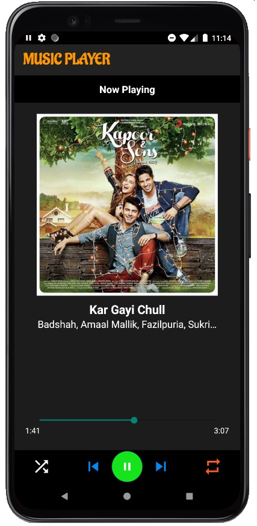

# Music-Player

### This is a Music Player app in which you can store songs in your playlist and play it in various ways like   
### shuffle and repeat which can be accessed from the app and the notification bar.

App Screens
-------
| Music Screen   |Album Screen      | 
| ------------- | ---------:|
|      | |

| Album List       | Player Screen          | 
| ------------- | -----:|
|       |  |

| Search Screen       | Notification Control        | 
| ------------- | -----:|
|       |  |

## Featues:-
#### - You can search the music or sort it on the basis of Name , Size , Date
#### - The songs can be played according to albums also
#### - You can shuffle or repeat the songs
#### - The songs can be controlled by mini player or by Notification 

